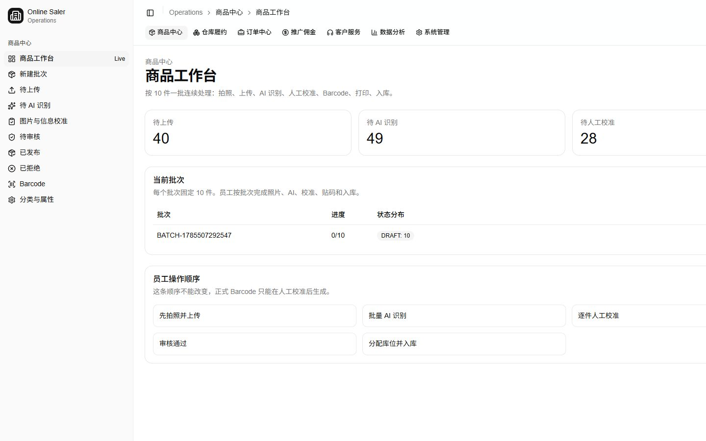
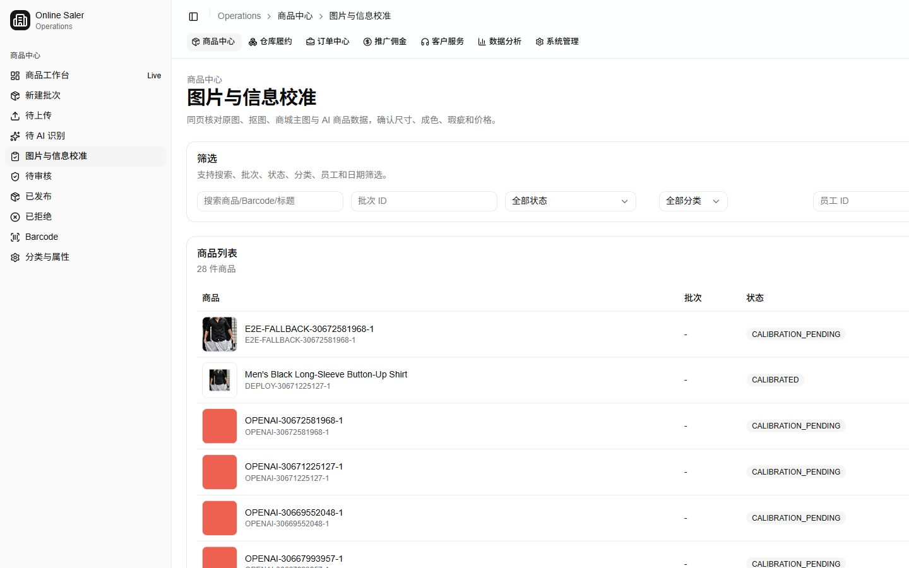

# Product Factory implementation audit

Audit date: 2026-08-01

Repository: `ericye666666-cmd/online-saler`

Base branch: `develop` at `ec653d50b9984ec6e001778747e0b66465b262af`

This audit distinguishes merged code from an employee-usable staging workflow. A merged backend or green unit test is not counted as Operations wiring or browser E2E proof.

## Current staging evidence

Observed on the live Operations staging deployment:

- A new `0/10` batch exposes upload, AI, Barcode, print, and stock-in actions at the same time.
- Product Center navigation is organized by internal product states instead of the employee's batch task.
- Product and batch statuses are shown as raw English enum values.
- The calibration queue is dominated by `DEPLOY-`, `E2E-`, `OPENAI-`, and `UPLOAD-` verification records.
- Calibration is a modal over a queue page, so the employee loses the batch as the primary context.
- The current batch action can submit AI, but image-processing progress is not represented in the batch response.
- Batch stock-in confirms placement without requiring the employee to scan the product and warehouse location.

## Historical PR landing audit

Legend: **Yes** means current `develop` contains the capability. **Partial** means only part of the employee workflow is connected. **No** means no current proof at that layer. **N/A** means the PR did not require that layer.

| PR | Goal | Backend merged | DB migrated | API deployed | Operations wired | Current route | Real API call | Browser E2E | Backend-only | Duplicate/deprecated | User config |
|---:|---|---|---|---|---|---|---|---|---|---|---|
| 4 | Product domain schema | Yes | Yes | Yes | Partial | Product Center | Yes | Partial | No | No | Cloud SQL |
| 5 | Product state rules/service | Yes | N/A | Yes | Partial | Product Center | Yes | Partial | No | No | None |
| 9 | AI extraction contract | Yes | N/A | Yes | Partial | Calibration | Yes | Partial | Yes | No | None |
| 10 | AI persistence and field decisions | Yes | Yes | Yes | Partial | Calibration | Yes | Partial | No | No | Cloud SQL |
| 11 | AI job API/mock provider | Yes | N/A | Yes | Partial | Waiting AI | Yes | Partial | No | Mock superseded in staging | AI provider mode |
| 12 | Human calibration API | Yes | N/A | Yes | Yes | `/product/calibration` | Yes | Yes | No | UI later superseded | Employee account |
| 13 | Formal Barcode generation API | Yes | N/A | Yes | Partial | `/product/barcode` | Yes | Partial | No | No | Barcode prefix |
| 14 | Operations AI test flow | Yes | N/A | Yes | Partial | Debug/legacy flow | Yes | Historical only | No | Superseded by Product Center | None |
| 16 | Same-origin Operations API proxy | Yes | N/A | Yes | Yes | `/api-proxy/*` | Yes | Yes | No | No | Runtime API URL |
| 18 | Staging schema bootstrap | Yes | Yes | Yes | N/A | N/A | Yes | N/A | Yes | No | Cloud SQL and Secret Manager |
| 19 | Staging test employee | Yes | Yes | Yes | Login uses linked employee | Operations login | Yes | Yes | No | No | Staging admin password |
| 20 | Digitization state gating | Yes | N/A | Yes | Partial | Product Center | Yes | Partial | No | UI gating now incomplete | None |
| 21 | Real image upload and storage | Yes | N/A | Yes | Yes | Upload actions | Yes | Yes | No | No | Storage bucket and IAM |
| 22 | Operations workspace v1 | Yes | N/A | Yes | Yes | Legacy workspace | Yes | Historical only | No | Superseded by Product Center | None |
| 24 | OpenAI Vision | Yes | N/A | Yes | Yes | AI actions | Yes | Yes | No | No | `OPENAI_API_KEY` |
| 25 | Local Barcode label printing | Yes | N/A | Yes | Partial | Batch table/Barcode | Local agent | Partial | No | No | Printer and local print agent |
| 26 | Product taxonomy fields | Yes | Yes | Yes | Read-only | `/product/taxonomy` | No management API | Partial | No | No | Shared enum release |
| 27 | Product control and location | Yes | Yes | Yes | Partial | Review/control actions | Yes | Partial | No | Random location conflicts with scan-first goal | Warehouse locations |
| 28 | Publish controls | Yes | N/A | Yes | Partial | Review/published | Yes | Partial | No | No | Publish permission |
| 29 | Storefront live products | Yes | N/A | Yes | N/A | Storefront catalog | Yes | Yes | No | No | Storefront API URL |
| 42 | Operations admin shell | Yes | N/A | Yes | Yes | All Operations routes | Yes | Yes | No | Navigation needs redesign | Admin roles |
| 43 | Operations RBAC | Yes | Yes | Yes | Yes | All Operations routes | Yes | Yes | No | No | Accounts, roles, permissions |
| 44 | Ten-item Product Batch workflow | Yes | Yes | Yes | Partial | Workbench/new batch | Yes | Partial | No | State-page UX must be replaced | Linked employee |
| 56 | Image pipeline contracts | Yes | N/A | Yes | N/A | N/A | N/A | N/A | Yes | No | None |
| 57 | Image processing persistence/API | Yes | Yes | Yes | Partial | Calibration | Yes | Yes | No | No | Cloud SQL |
| 58 | remove.bg processor | Yes | N/A | Yes | Provider retained | Calibration retry | Yes if configured | Historical only | No | Optional fallback only | Optional API key |
| 59 | First lightweight processor branch | No | N/A | No | No | N/A | No | No | N/A | Closed; superseded by PR60 | None |
| 60 | Lightweight OpenCV processor | Yes | N/A | Yes | Yes | Upload/calibration | Yes | Yes | No | No | Service URL and IAM |
| 61 | Self-hosted rembg + BiRefNet | Yes | N/A | Yes | Yes | Calibration retry | Yes | Yes | No | No | Service URL and IAM |
| 62 | Quality-based automatic fallback | Yes | Yes | Yes | Metadata visible | Calibration | Yes | Yes | No | No | Quality threshold |
| 63 | Staging deployment for both processors | Yes | N/A | Yes | N/A | N/A | Yes | Health checks | Yes | No | Artifact Registry, Cloud Run, IAM |
| 64 | Pillow dependency pin | Yes | N/A | Yes | N/A | N/A | Yes | Health check | Yes | No | None |
| 65 | Migration script in API runtime | Yes | N/A | Yes | N/A | N/A | Yes | Deploy workflow | Yes | No | None |
| 66 | Safe P3009 migration recovery | Yes | N/A | Yes | N/A | N/A | Yes | Deploy workflow | Yes | No | Cloud SQL access |
| 67 | Real image-processing staging E2E | Yes | N/A | Yes | N/A | N/A | Yes | API-level real image | Yes | No | Staging test image |
| 68 | Unified image and product calibration | Yes | N/A | Yes | Yes | `/product/calibration` | Yes | Yes | No | Modal UX needs batch redesign | None |
| 69 | Append-only image reruns | Yes | Yes | Yes | Yes | Calibration rerun | Yes | Yes | No | No | None |

## Capability verdict

The repository already contains the main technical primitives. The remaining product work is integration and workflow design:

1. Replace state-first navigation with batch-first task navigation.
2. Add a dedicated batch detail route and derive exactly one legal next action.
3. Make upload sequential and multi-image-aware while preserving originals.
4. Represent AI extraction and image processing as one employee-visible batch stage.
5. Turn calibration into a full-page, mobile-first batch task.
6. Add label scan confirmation and product-plus-location scan stock-in.
7. Add editable taxonomy/configuration surfaces and a non-secret configuration checker.
8. Re-run the complete ten-item workflow in the browser on desktop and `390x844`.

## Data safety

- Existing staging verification records are hidden by default, not deleted.
- Original `ProductImage` records and storage objects remain immutable.
- Image reruns create new variant assets.
- Barcode creation remains gated behind `CALIBRATED`.
